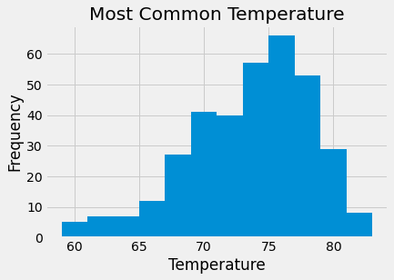
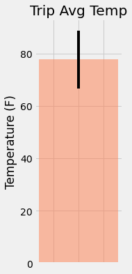
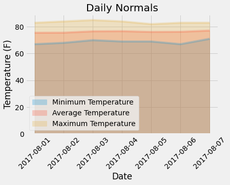

# sqlalchemy-challenge

## Surf's Up!
Using SQLAlchemy, Pandas, and Flask to do climate analysis based on precipitation and temperature data from Hawaii.

### Climate Analysis
Data from a SQLite file was analyzed using SQLAlchemy, Pandas, and Matplotlib to look at precipitation and temperature data. The most recent date in the dataset was determine and datetime calculation was used to identify the last year of data. Precipitation data for this period was retrieved and plotted in a bar graph. 

The number of stations collecting data was identified and the ID of the most active station was found. Using this information, temperature information from the last year of data was retrieved and plotted in a histogram. 

###Climate App
Using Flask and the Hawaii data, both static and dynamic routes were created to return climate and station information. Static routes included precipitation by date, a list of the stations collecting data, and temperature observations of the most active station for the last year of data. Dynamic routes return minimum temperature, average temperature, and the max temperature for a start or start-end range, with the date(s) given in the url. 

###Bonus
In part 1 of the bonus, temperature data from June and December was analyzed to determine if there is statistical significance between overall averages for those months.

In part 2, the data was used to calculate and plot minimum, avg, and max temperatures for a specific range of dates, in this case August 1st to 7th in 2016. Average rainfall was also calculated for this period. 

Daily temperature normals for this date period were also calculated and plotted in an area plot. 

