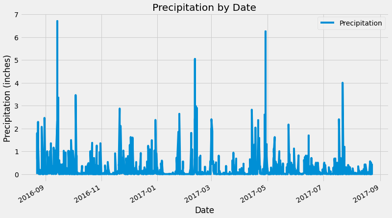

# sqlalchemy-challenge

## Surf's Up!
Using SQLAlchemy, Pandas, and Flask to do climate analysis based on precipitation and temperature data from Hawaii.

### Climate Analysis
Data from a SQLite file was analyzed using SQLAlchemy, Pandas, and Matplotlib to look at precipitation and temperature data. The most recent date in the dataset was determine and datetime calculation was used to identify the last year of data. Precipitation data for this period was retrieved and plotted in a bar graph. 

